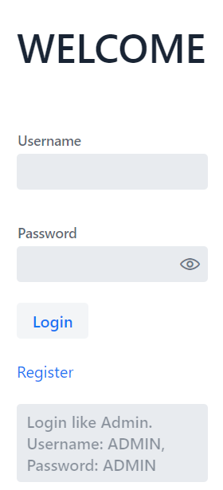
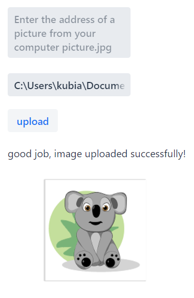

# Photo Hosting	
> Hosting image files. Attach a file from disk and share it with your friends.

## Table of Contents
* [General Info](#general-information)
* [Technologies Used](#technologies-used)
* [Features](#features)
* [Screenshots](#screenshots)
* [Setup](#setup)
* [Project Status](#project-status)
* [Contact](#contact)

## General Information
Share photos with logged in friends. Create a group where you can exchange photos.

## Technologies Used
- Spring Boot
- cloudinary
- vaadin
- mySql
- rest Api

## Features
(1)
    Login: UserJan
    Password: UserJan
    Role: USER
    isEnabled: true

User with access to the gallery with the option of uploading files.

(2)
    Login: UserMarian
    Password: UserMarian
    Role: USER
    isEnabled: false

User who has not confirmed registration via email. No accesses.

(3)
    Login: AdminAngelika
    Password: AdminAngelika
    Role: ADMIN
    isEnabled: true

User who can browse the gallery and add new pictures.

(4)
    Login: AdminMariola
    Password: AdminMariola
    Role: ADMIN
    isEnabled: false

User who has not confirmed registration via email. No accesses.

## Screenshots
    http: // localhost: 8080 / login

Logging in, taking over to registration if the user is not registered.

    http: // localhost: 8080 / register
New user registration

    http: // localhost: 8080 / upload

Upload pictures, only for the role: ADMIN

    http: // localhost: 8080 / gallery
Viewing uploaded images.

## Setup
Clone the project to your own ide, run it and navigate to http: // localhost: 8080 / login

## Project Status
Project is: complete 
// waiting for inspiration what else can be done here

## Contact
Created by [_qubiak_]( http://www.linkedin.com/in/bartłomiej-kubiak) - feel free to contact me!

